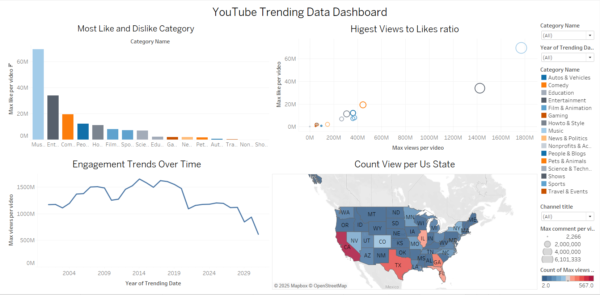

# 📊 YouTube Trending Video Analysis (Tableau Project)

An interactive data storytelling dashboard analyzing YouTube trending videos using Tableau Public. This project explores engagement, category performance, viewership trends, and regional preferences across the U.S.

---

## 🔗 Live Visualizations

- **Dataset link** [Youtube Dataset](https://drive.google.com/drive/folders/1YfH8SFSaGi3XAsHm61_BiqdbgOB6lc1R?usp=drive_link)
- **Insight 1:** [Bar Plot – Most Liked Categories](https://public.tableau.com/app/profile/daizy.asmani/viz/MostLikeCategory/Mostlikeyoutubecategory?publish=yes)  
- **Insight 2:** [Line Plot – Views & Engagement Over Time](https://public.tableau.com/app/profile/daizy.asmani/viz/EngagementTrendsOverTime/Engagementtrendsovertime?publish=yes)  
- **Insight 3:** [Scatter Plot – Correlation Between Views & Likes](https://public.tableau.com/app/profile/daizy.asmani/viz/HigestViewstoLikesratio/Relatioshipbetweenviewsprlikes?publish=yes) 
- **Insight 4:** [Graph – Top Trending Video Views by State](https://public.tableau.com/app/profile/daizy.asmani/viz/HighestViewsbyUsstate/TopTrendingVideosbyLocation?publish=yes)  
- **📊 Full Dashboard:** [YouTube Trending Video Analysis Dashboard](https://public.tableau.com/app/profile/daizy.asmani/viz/YouTubeTrendingdataDashboard/Dashboard2?publish=yes)

---

## 📌 Summary of Insights

### 🎵 Insight 1: Most Liked Categories (Bar Plot)
This bar plot shows the most liked/disliked video categories.  
**Main Finding:** Music and Entertainment dominate positive engagement. News and niche topics have mixed reactions.

### 📈 Insight 2: Views & Engagement Over Time (Line Plot)
Trends over time highlight seasonal engagement spikes.  
**Main Finding:** Channels like 1 Million Dance Studio peak in March, suggesting seasonal virality.

### 🔁 Insight 3: Correlation Between Views & Likes (Scatter Plot)
Shows how views and likes are (or aren’t) correlated.  
**Main Finding:** Viral views don't always mean more likes or comments.

### 📍 Insight 4: Top Trending Videos by State (Graph)
Displays most-viewed content by U.S. state.  
**Main Finding:** Regional preferences exist — creators can tailor content by location.

---

## 🎨 Design Choices

- **Bar Plot:** Used contrasting colors for likes/dislikes to ensure visual clarity.
- **Line Plot:** Simplified color scheme to reduce clutter, focusing on trends over time.
- **Scatter Plot:** Dot sizes represent views for visual weight; colors differentiate categories.
- **Map/Graph Plot:** Designed to emphasize regional differences in trending content.

---

## 📌 Tools Used
- **Tableau Public** for dashboard development
- **YouTube Trending Dataset**
- **Markdown** for this documentation

---

## 📷 Preview

---

## 🚀 How to Use
Click the links above to interact with the full dashboard and explore different insights.

